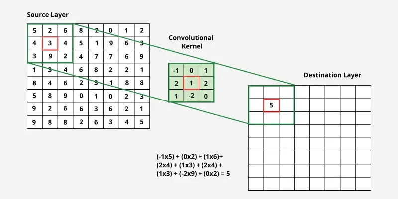
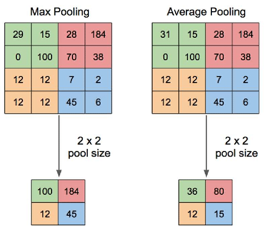

# CNN-from-scratch

## Convolutional Neural Networks (CNNs) Theory and Basics

### Introduction

Convolutional Neural Networks (CNNs) changed how machines understand visual data, enabling breakthroughs in image recognition and video analysis. CNNs were first introduced in the late 1980s (LeNet, 1989), but gained widespread practical success with the ImageNet competition in 2012.

**Why not just use Dense Networks?**
Before CNNs, dense (fully connected) neural networks were the primary approach, but they had critical limitations for images:
- **Loss of Locality:** Dense networks treat each pixel independently, flattening spatial structure.
- **Parameter Explosion:** Connecting every pixel to every neuron leads to overfitting and inefficient training.
- **No Spatial Hierarchy:** Dense layers do not naturally exploit local patterns like edges or shapes.

CNNs solved these problems by introducing **convolutional layers** with learnable filters. Weight sharing and local connectivity drastically reduce the amount of parameters, preserving spatial relationships and enabling efficient training on large datasets.

This README explains the core theory behind CNNs, focusing on convolution and pooling layers and their mathematical foundations.

---

## Convolution Fundamentals

### What is a kernel/filter?

A kernel (also called a filter) is a small matrix of learnable weights that slides over the input. Each filter detects a specific pattern, such as an edge or texture. A layer can have many filters, producing multiple output feature maps (channels).



### Clarifying Terminology
- **Kernel vs Filter:** Often used interchangeably. Technically, a "kernel" is the 2D matrix, and a "filter" is the collection of kernels for all input channels (e.g., a 3x3x3 filter).
- **Output Channels:** A single filter produces one output channel (feature map). If a layer has $N$ filters, it will produce $N$ output channels.
- **Color (RGB):** The filter depth always matches the input depth. For an RGB image (3 channels), the filter is $3 \times 3 \times 3$.

### Mathematical Nuance: Convolution vs. Cross-Correlation
While deep learning frameworks refer to the sliding window operation as "convolution," there is a subtle mathematical distinction.

1.  **Cross-Correlation:** This is the sliding dot-product operation we typically perform in neural networks (as seen in the "Sliding Window" example below).
2.  **True Convolution:** Mathematically, a true convolution requires **rotating the kernel by 180 degrees** before sliding it over the input.

$$\text{conv}(I, K) = I * \text{rot180}(K)$$

In the forward pass, we use cross-correlation. However, the concept of "True Convolution" (with the rotation) becomes critical during **Backpropagation** when we calculate gradients for the input layer.

### Stride and Padding

- **Stride (S):** How far the filter moves between positions.
  - Stride = 1 samples every location.
  - Stride > 1 downsamples the output.
- **Padding (P):** Adding zeros around the input border.
  - **Valid (P=0):** Output is smaller than input.
  - **Same:** Output size matches input size (requires specific padding).
  - **Full:** A mode used in backpropagation where the kernel slides such that even a single pixel of intersection counts (heavily padded).

### Output Size Formulas

For a 2D input with height $H$ and width $W$, kernel size $F$, padding $P$, and stride $S$:

$$H_{out} = \lfloor \frac{H + 2P - F}{S} \rfloor + 1$$

$$W_{out} = \lfloor \frac{W + 2P - F}{S} \rfloor + 1$$


### Connectivity and Receptive Fields (CS231n logic)

Understanding how neurons connect to the input volume is crucial for parameter counting.

**Example 1:**
For example, suppose that the input volume has size **[32x32x3]**, (e.g. an RGB CIFAR-10 image). If the receptive field (or the filter size) is **5x5**, then each neuron in the Conv Layer will have weights to a **[5x5x3]** region in the input volume, for a total of $5 \cdot 5 \cdot 3 = 75$ weights (and +1 bias parameter).
> **Note:** The extent of the connectivity along the depth axis must be **3**, since this is the depth of the input volume.

**Example 2:**
Suppose an input volume had size **[16x16x20]**. Then using an example receptive field size of **3x3**, every neuron in the Conv Layer would now have a total of $3 \cdot 3 \cdot 20 = 180$ connections to the input volume.
> **Note:** Again, the connectivity is local in 2D space (e.g. 3x3), but **full along the input depth** (20).

### The 2D Convolution Equation

For an input $X$ and a kernel $K$, the output $Y$ at position $(i, j)$ is:

$$Y[i, j] = \sum_{m=0}^{F-1} \sum_{n=0}^{F-1} K[m, n] \cdot X[i + m, j + n] + Bias$$

*(Note: In practice, deep learning frameworks implement cross-correlation, which is equivalent for learning purposes.)*

---

### Concrete Example: The Sliding Window

**Settings:**
- **Input:** 4x4 Matrix
- **Kernel:** 2x2 Matrix
- **Stride:** 1
- **Padding:** 0

**The Input Matrix:**
[[1, 2, 3, 0], [0, 1, 2, 3], [3, 0, 1, 2], [2, 3, 0, 1]]


**The Kernel (Filter):**
[[ 1, 0], [-1, 1]]


**Step 1: Top-Left Patch**

We overlay the kernel on the first 2x2 patch of the input.

Input Patch:
[[1, 2], [0, 1]]


Calculation:

$(1 \cdot 1) + (2 \cdot 0) + (0 \cdot -1) + (1 \cdot 1)$

$= 1 + 0 + 0 + 1$

$= 2$

Output Map: `[[2, ?, ?], ...]`

**Step 2: Slide Right (Stride 1)**

Move the kernel one pixel to the right.

Input Patch:
[[2, 3], [1, 2]]


Calculation:

$(2 \cdot 1) + (3 \cdot 0) + (1 \cdot -1) + (2 \cdot 1)$

$= 2 + 0 - 1 + 2$

$= 3$

Output Map: `[[2, 3, ?], ...]`

**Step 3: Slide Right Again**

Move the kernel one more pixel to the right.

Input Patch:
[[3, 0], [2, 3]]


Calculation:

$(3 \cdot 1) + (0 \cdot 0) + (2 \cdot -1) + (3 \cdot 1)$

$= 3 + 0 - 2 + 3$

$= 4$

Output Map: `[[2, 3, 4], ...]`

...and so on, sliding down to the next row once the width is covered.

---

## Parameter Sharing in Convolutional Layers

Parameter sharing is a key mechanism that makes CNNs efficient. Instead of having unique weights for every neuron, neurons in the same depth slice share the same weights.

### Why Parameter Sharing Works

If detecting a horizontal edge is important at one location in an image, it should be useful at other locations too due to the translationally-invariant structure of images. There's no need to relearn edge detection at every spatial position.

### Parameter Count Example

Consider the first Conv Layer with output size [55x55x96]:
- **Without parameter sharing:** 55×55×96 = 290,400 neurons, each with 11×11×3 = 363 weights + 1 bias = 105,705,600 parameters
- **With parameter sharing:** Only 96 unique filters, each with 11×11×3 weights = 34,848 weights + 96 biases = 34,944 parameters

This dramatic reduction (from 105M to 35K parameters) is what makes CNNs trainable on large images.

### When Parameter Sharing Might Not Apply

For images with specific centered structure (like faces), different features might need to be learned at different spatial locations. In such cases, a **Locally-Connected Layer** (without parameter sharing) might be used instead.

---

## Convolutional Layer - Backpropagation

To train the network, we must calculate the gradients of the Loss ($E$) with respect to the trainable parameters (Kernels and Biases) and the Input (to pass the error to the previous layer).

### 1. Gradient w.r.t Kernels (Weights)
We need to calculate $\frac{\partial E}{\partial K}$.
The gradient for a specific weight is the sum of gradients from all outputs where that weight contributed.
* **Operation:** This is mathematically equivalent to the **Cross-Correlation** between the **Input ($X$)** and the **Output Gradient ($\frac{\partial E}{\partial Y}$)**.

$$\frac{\partial E}{\partial K} = X * \frac{\partial E}{\partial Y}$$

### 2. Gradient w.r.t Bias
The bias is added to every element in the output feature map. Therefore, the gradient w.r.t the bias is simply the sum of all the gradients in the output map.

$$\frac{\partial E}{\partial B} = \sum \frac{\partial E}{\partial Y}$$

### 3. Gradient w.r.t Input ($X$)
We need to calculate $\frac{\partial E}{\partial X}$ to propagate the error backward.
* **Intuition:** One pixel in the input affects multiple pixels in the output (due to the sliding window). We must collect the error from all those output pixels back to the input pixel.
* **Operation:** This corresponds to a **Full Convolution** between the **Output Gradient** and the **Rotated Kernel (180°)**.

$$\frac{\partial E}{\partial X} = \frac{\partial E}{\partial Y} *_{\text{full}} \text{rot180}(K)$$

**Why Rotate?** In the forward pass, the kernel slides over the input. In the backward pass, the error "slides back" to the input. To align the error correctly with the pixels that generated it, the spatial orientation of the kernel must be flipped.

---

## Pooling Basics

### What Pooling Does

Pooling reduces spatial dimensions of feature maps, lowering computation and introducing translation invariance.



### Max vs Average Pooling

- **Max pooling:** Picks the maximum value in the window.
- **Average pooling:** Computes the average value.

**Note:** Pooling layers have zero learnable parameters.

### Pros and Cons of Pooling

**Pros:** Reduces computation (fewer pixels), creates larger receptive fields, adds robustness to shifts.

**Cons:** Loses precise spatial detail and pixel-perfect localization.

### Output Size Formula

$$\text{Output Size} = \lfloor \frac{N + 2P - F}{S} \rfloor + 1$$

---

## Additional Layers & Loss Functions

### Reshape Layer
The output of a convolutional block is a 3D tensor (Channels, Height, Width). However, standard classification layers (Dense/Fully Connected) expect a 1D column vector.
* **Forward:** Flattens the 3D block into a 1D vector.
* **Backward:** Reshapes the 1D gradient vector back into the 3D shape for the convolutional layers.
* 
### Binary Cross Entropy Loss
For binary classification (e.g., Is this digit 0 or 1?), we use Binary Cross Entropy.

$$
E = -\frac{1}{n}\sum (y_{true} \log(y) + (1-y_{true}) \log(1-y))
$$

Where $y$ is the predicted value and $y_{true}$ is the true value. The derivative w.r.t the output $y$ (which is fed into the backward pass) is:

$$
\frac{\partial E}{\partial y} = \frac{1}{n} \left( \frac{1-y_{true}}{1-y} - \frac{y_{true}}{y} \right)
$$

### Sigmoid Activation
Since Cross Entropy uses logarithms, we need an activation function bounded between 0 and 1.

$$\sigma(x) = \frac{1}{1 + e^{-x}}$$

---

## Layer Connectivity and Data Flow

1. **Convolution Layers:** Apply learnable filters. Input depth = Input Channels. Output depth = Number of Filters.
2. **Pooling Layers:** Downsample spatially. Depth remains constant.
3. **Flatten:** Reshapes the 3D tensor (Height, Width, Depth) into a 1D vector.
4. **Dense Layers:** Fully connected layers for final classification.

### Shape Calculations (Example Architecture)

**Input:** (32, 32, 3) RGB image

1. **Conv1:** F=3, P=0, S=1, filters=32  
   - Output: (30, 30, 32)
2. **MaxPool1:** F=2, S=2  
   - Output: (15, 15, 32)
3. **Conv2:** F=3, P=0, S=1, filters=64  
   - Output: (13, 13, 64)
4. **MaxPool2:** F=2, S=2  
   - Output: (6, 6, 64)
5. **Conv3:** F=3, P=0, S=1, filters=64  
   - Output: (4, 4, 64)
6. **Flatten:** $4 \times 4 \times 64$  
   - Output: 1024 features
7. **Dense:** Output 10

---

## Filter Selection and Redundancy

### Why do we choose 32 or 64 filters?

- **Spatial Reduction vs. Depth Increase:** As the image passes through the network, $H$ and $W$ shrink (via Pooling), but we typically increase the number of filters. Early layers (16-32 filters) capture simple lines. Deep layers (64-128 filters) capture complex object parts.
- **Small Input Redundancy:** Applying 32 filters to a tiny raw input (e.g., 4x4 pixels) is inefficient because the input lacks enough information (16 pixels) to generate 32 unique, meaningful features. This leads to duplicate filters or noise.

---

## Implementation Details

### im2col: Efficient Convolution via Matrix Multiplication

A common implementation pattern converts convolution into matrix multiplication:

1. **Stretch input regions into columns (im2col):** For a [227x227x3] input with 11x11x3 filters at stride 4, extract [11x11x3] blocks and stretch each into a column vector of size 363. This creates a matrix X_col of size [363 x 3025] (since (227-11)/4+1 = 55, and 55×55 = 3025 locations).

2. **Stretch filters into rows:** 96 filters of size [11x11x3] become a matrix W_row of size [96 x 363].

3. **Matrix multiply:** The convolution becomes `np.dot(W_row, X_col)`, producing [96 x 3025].

4. **Reshape:** Convert back to proper output dimensions [55x55x96].

**Trade-off:** Uses more memory (input values duplicated in X_col), but leverages highly optimized matrix multiplication libraries (BLAS).

### 1x1 Convolutions

1x1 convolutions may seem pointless in 2D signal processing, but in CNNs they perform 3D dot products across the depth dimension. For input [32x32x3], a 1x1 conv computes dot products with all 3 channels, allowing channel-wise transformations. First investigated in Network in Network paper.

### Dilated Convolutions

Dilated convolutions introduce gaps between filter cells:
- **Dilation 0 (standard):** `w[0]*x[0] + w[1]*x[1] + w[2]*x[2]`
- **Dilation 1:** `w[0]*x[0] + w[1]*x[2] + w[2]*x[4]`

**Benefit:** Expands receptive field without increasing parameters. Two 3x3 dilated convolutions can capture information from larger areas than standard convolutions, useful for capturing multi-scale context.

---

## Converting FC Layers to CONV Layers

Any Fully-Connected layer can be converted to a Convolutional layer:

**Example:** An FC layer with 4096 neurons looking at [7x7x512] volume = CONV layer with F=7, P=0, S=1, K=4096, producing [1x1x4096].

### Practical Application: Efficient Sliding Window

This conversion enables efficient evaluation across multiple spatial positions:

1. **Standard approach:** Forward a 224x224 image through a ConvNet → [7x7x512] → FC layers → [1x1x1000] class scores
2. **Converted approach:** Forward a 384x384 image through converted ConvNet → [12x12x512] (since 384/32=12) → CONV layers → [6x6x1000] scores

Instead of running the original network 36 times at different crops (stride 32 pixels), the converted network produces a 6x6 grid of class scores in a single forward pass by sharing computation.

**Use case:** Resize images to be larger, evaluate at many positions, and average scores for better performance.

---

## ConvNet Architecture Patterns

### Common Layer Patterns

**Standard pattern:**
INPUT -> [[CONV -> RELU]*N -> POOL?]*M -> [FC -> RELU]*K -> FC


Where:
- N ≥ 0 (usually N ≤ 3): Number of CONV layers before pooling
- M ≥ 0: Number of CONV-POOL blocks
- K ≥ 0 (usually K < 3): Number of FC layers
- POOL? indicates optional pooling

**Examples:**
- `INPUT -> FC`: Linear classifier (N=M=K=0)
- `INPUT -> CONV -> RELU -> FC`
- `INPUT -> [CONV -> RELU -> POOL]*2 -> FC -> RELU -> FC`
- `INPUT -> [CONV -> RELU -> CONV -> RELU -> POOL]*3 -> [FC -> RELU]*2 -> FC`

### Why Stack Small Filters?

**Prefer multiple 3x3 CONV layers over one large filter:**

Three stacked 3x3 CONV layers vs. one 7x7 CONV layer:
- **Same receptive field:** Both see 7x7 region of input
- **More non-linearities:** Three ReLU activations vs. one = more expressive features
- **Fewer parameters:** 3×(C×3×3×C) = 27C² vs. C×7×7×C = 49C²

**Practical note:** Requires more memory for intermediate results during backpropagation.

---

## Layer Sizing Best Practices

### Input Layer
- Should be divisible by 2 many times
- Common sizes: 32 (CIFAR-10), 64, 96 (STL-10), 224 (ImageNet), 384, 512

### Convolutional Layers
- **Small filters:** 3x3 or at most 5x5
- **Stride:** S=1
- **Padding:** Preserve spatial dimensions
  - F=3 → P=1 (preserves size)
  - F=5 → P=2 (preserves size)
  - General: P=(F-1)/2
- **Exception:** First layer might use 7x7 or 11x11 filters looking at raw pixels

### Pooling Layers
- **Most common:** F=2, S=2 (discards 75% of activations)
- **Alternative:** F=3, S=2 (overlapping pooling)
- **Avoid:** Larger receptive fields (too destructive)
- **No padding typically used**

### Why These Conventions?

- **Stride 1 in CONV:** Leaves all spatial downsampling to POOL layers; CONV only transforms depth
- **Padding in CONV:** Preserves spatial size, prevents border information from being "washed away" too quickly
- **POOL for downsampling:** Clear separation of concerns; easier architecture design

### Memory Compromises

For large inputs (e.g., 224x224x3), early layers consume significant memory. Example:
- Three 3x3 CONV layers with 64 filters, padding 1 on [224x224x3]
- Creates three [224x224x64] volumes ≈ 10M activations ≈ 72MB per image

**Common compromises:**
- Use larger stride in first CONV (e.g., 7x7 with stride 2, or 11x11 with stride 4)
- Reduce batch size

---
## Computational and Memory Considerations

### Three Major Memory Sources

1. **Intermediate volumes:** Activations at every layer + their gradients (equal size). Most activations in early layers. Can be reduced at test time by discarding previous layer activations.

2. **Parameters:** Network weights + gradients + optimization state (momentum, Adagrad, RMSProp caches). Multiply parameter count by ≈3× for total memory.

3. **Miscellaneous:** Image batches, augmented versions, etc.

### Memory Calculation
Total values × 4 bytes (float32) / 1024³ = Memory in GB


Or × 8 bytes for double precision.

### Making Networks Fit

**Primary strategy:** Reduce batch size (activations consume most memory).

---

## Normalization Layers

Many normalization schemes have been proposed (inspired by biological inhibition), but **in practice their contribution has been minimal**. Modern architectures rarely use them. See Alex Krizhevsky's cuda-convnet library for various normalization types.

---

## Getting Rid of Pooling

Recent trends suggest pooling may not be necessary:
- **Alternative:** Use larger stride in CONV layers occasionally for downsampling
- **Evidence:** Important for training generative models (VAEs, GANs)
- **Future:** Architectures may feature few or no pooling layers

---

## TensorFlow Reference Code
```python
model = models.Sequential([
    layers.Conv2D(32, (3, 3), activation='relu', input_shape=(32, 32, 3)),
    layers.MaxPooling2D((2, 2)),
    layers.Conv2D(64, (3, 3), activation='relu'),
    layers.MaxPooling2D((2, 2)),
    layers.Conv2D(64, (3, 3), activation='relu'),
    layers.Flatten(),
    layers.Dense(64, activation='relu'),
    layers.Dense(10, activation='softmax'),
])
