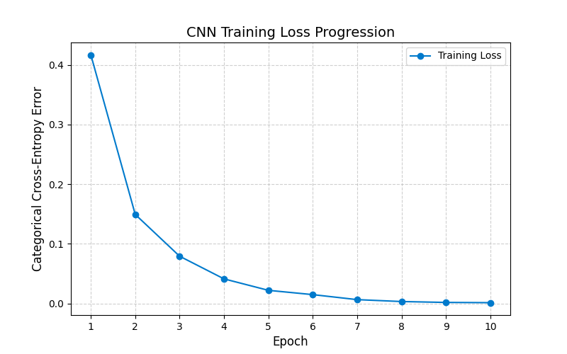
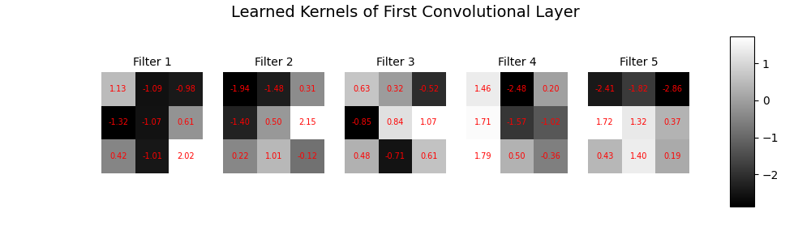

# CNN From Scratch using JAX (Manual Backpropagation)


## Project Overview

This project implements a Convolutional Neural Network (CNN) entirely from scratch using JAX.

**Crucial Distinction:** Unlike standard JAX projects that rely on `jax.grad` for automatic differentiation, this project **manually implements the backward pass**. JAX is used strictly as a high-performance linear algebra library (similar to NumPy), but all gradients for Convolution, Max Pooling, and Fully Connected layers are mathematically derived and hard-coded.

This approach demonstrates a fundamental understanding of the calculus behind deep learning, rather than relying on framework abstractions to handle the math.

### Core Implementation Details
* **No AutoDiff:** The project does not use `jax.grad`, `jax.value_and_grad`, or `optax`.
* **Manual Gradients:** The derivative for every operation (including 2D convolution relative to inputs and weights) is calculated explicitly in code.
* **Pure JAX Arrays:** Utilizes `jax.numpy` for efficient, hardware-accelerated array operations without high-level wrapper libraries.
* **Custom Optimizer:** Implemented Stochastic Gradient Descent (SGD) from first principles.

---

## Mathematical Derivations

Since this project avoids automatic differentiation, every gradient used in the training process had to be derived manually.

For a detailed breakdown of the calculus, including the chain rule applications for the Convolutional and Pooling layers, please refer to the **[THEORY.md](./THEORY.md)** file included in this repository.

It covers:
1.  **Forward Propagation:** The mathematical formulation of the Conv2D and MaxPool operations.
2.  **Backpropagation:** The explicit derivation of gradients $\frac{\partial L}{\partial W}$ and $\frac{\partial L}{\partial X}$ for 4D tensors.
3.  **Shape Analysis:** How dimensions change through the network pipeline.

---

## Performance & Results

The model was trained on the MNIST handwritten digit dataset.

**Final Test Accuracy: 95.77%**
(Evaluated on the full 10,000-sample test set)

### Convergence Table
The training shows a consistent decrease in error, proving the stability of the manual gradient derivation.

| Epoch | Average Error | Time (Seconds) |
| :---: | :---: | :---: |
| 1 | 0.4169 | 180.25 |
| 2 | 0.1493 | 198.85 |
| 3 | 0.0792 | 177.24 |
| 4 | 0.0412 | 168.24 |
| 5 | 0.0220 | 169.94 |
| 6 | 0.0148 | 174.71 |
| 7 | 0.0064 | 173.28 |
| 8 | 0.0032 | 171.21 |
| 9 | 0.0017 | 164.74 |
| **10** | **0.0013** | **162.70** |

---

## Visualizations

### 1. Training Loss Curve
The plot below visualizes the minimization of the Categorical Cross-Entropy loss over 10 epochs.



### 2. Learned Convolutional Filters
These are the actual 3x3 kernels learned by the first layer of the network. The visual contrast (light vs. dark) indicates the network successfully learned to detect edges and gradients in the pixel data.



---

## Architecture (LeNet-Style)

The model processes the input as a 3D volume (Channels, Height, Width).

| Layer | Type | Configuration | Output Shape |
| :--- | :--- | :--- | :--- |
| **Input** | Image | Grayscale (Normalized) | (1, 28, 28) |
| **1** | `Conv2D` | Filters: 5, Kernel: 3x3 | (5, 26, 26) |
| **2** | `ReLU` | Activation | (5, 26, 26) |
| **3** | `MaxPool` | Pool: 2x2, Stride: 2 | (5, 13, 13) |
| **4** | `Flatten` | Reshape 3D -> 1D | (845) |
| **5** | `Dense` | Fully Connected | (64) |
| **6** | `ReLU` | Activation | (64) |
| **7** | `Dense` | Fully Connected | (10) |
| **8** | `Softmax` | Probability Distribution | (10) |

---

## Project Structure

* `model.py`: Entry point. Assembles layers, manages the training loop, and runs evaluation.
* `Convolutional.py`: Contains the manual forward and backward pass logic for 2D convolution.
* `Pooling_layer.py`: Implements Max Pooling and gradient upsampling.
* `DenseLayer.py`: Standard fully connected layer implementation.
* `loss.py`: Cross-Entropy loss and its derivative calculation.
* `THEORY.md`: **[Deep Dive]** Detailed mathematical derivation of the backpropagation formulas used in this project.

---

## Quick Start

1.  **Clone the Repository**
    ```bash
    git clone [https://github.com/ojayballer/CNN-from-scratch-using-JAX.git](https://github.com/ojayballer/CNN-from-scratch-using-JAX.git)
    cd CNN-from-scratch-using-JAX
    ```

2.  **Install Dependencies**
    ```bash
    pip install jax jaxlib matplotlib
    ```

3.  **Run the Model**
    ```bash
    python model.py
    ```

---

**Author:** OjayBaller
